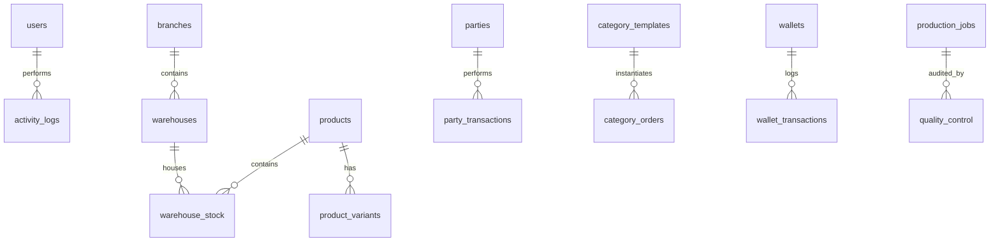
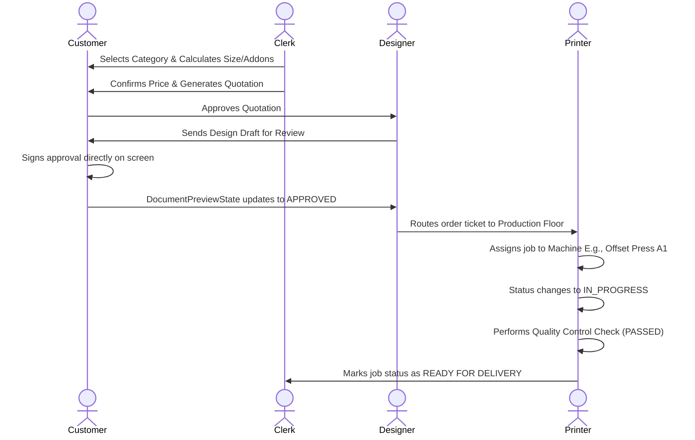
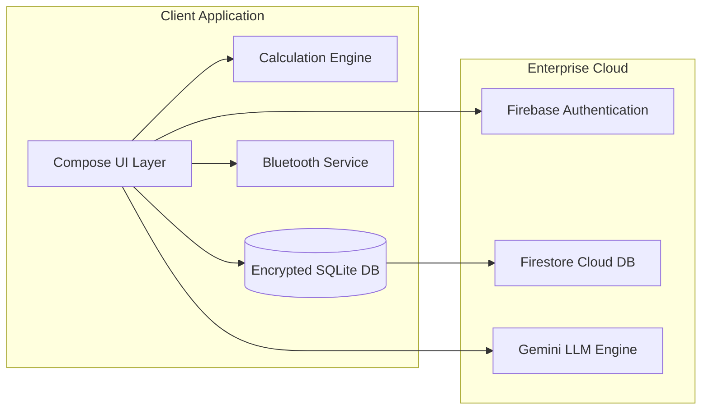
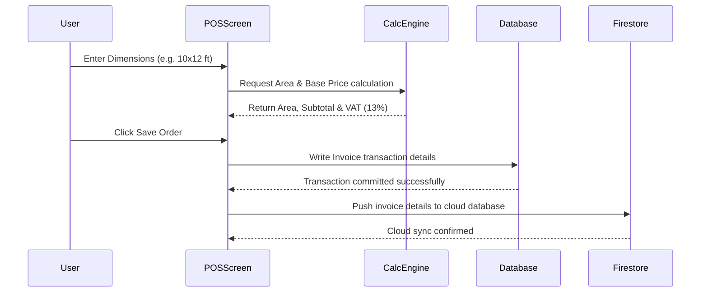

# EYEMAZE APPLICATION BLUEPRINT
**Enterprise-Grade Software Specification & Architecture Map**
**Target Application**: Eyemaze Suite (Enterprise Printing Studio ERP, POS, and Intelligence Node)
**Target Platform**: Android (Kotlin / Jetpack Compose)
**Database**: SQLCipher Encrypted Room DB (Offline-First) + Cloud Sync (Firebase Firestore)
**AI Engine**: Gemini 2.5 Flash / 3.1 Pro via Generative AI SDK

---

## 1 Executive Summary

### 1.1 Application Purpose
The **Eyemaze Suite** is an all-in-one business intelligence, enterprise resource planning (ERP), point-of-sale (POS), accounting, and production floor orchestration platform custom-designed for the printing, flex banner, advertising, and publication industry in Nepal. The application bridges the gap between daily retail point-of-sale activities, physical print floor queue management, financial accounting ledgers, HR payroll/attendance tracking, and AI-powered intelligence analytics.

### 1.2 Business Goals
*   **Operational Optimization**: Automate the complex dimensional calculations of physical media (flex print area, sticker sheets, wastage, linear roll length) directly on the shop floor.
*   **Financial Integrity**: Establish a tamper-proof double-entry accounting journal, VAT register, and automated bank reconciliation engine.
*   **Security & Compliance**: Enforce high-security standards using hardware-backed biometrics, device root/compromise auditing, and cryptographically signed action logs.
*   **Offline-First Autonomy**: Ensure the printing studio can run 100% of its operations (POS, billing, inventory, design library) during internet outages, with subsequent automatic synchronization.

### 1.3 Target Users
*   **Business Owners / Administrators**: Monitor overall profitability, bank balances, owner equity withdrawals, and review audit trails.
*   **Sales & Billing Clerks**: Generate VAT-compliant invoices, parse incoming customer bills via OCR, handle customer ledgers, and manage quotients.
*   **Print Floor Operators / Designers**: Coordinate design approval queues, control machinery statuses, log quality checks, and track tasks.
*   **Staff Members**: Register attendance (clock-in/clock-out) and manage personal loan installments.

### 1.4 Core Problems Solved
*   **Complex Dimensional Invoicing**: Multi-variate pricing rules (area calculations, sheet slab tiers, binding page-counts, and custom finishes like lamination, UV coating, eyelets) are automatically resolved by a central mathematical engine.
*   **Dynamic Localization**: Real-time conversion between Gregorian (AD) and Bikram Sambat (BS - Nepali calendar) dates, land measurement units (Ropani-Aana-Paisa-Daam vs. Bigha-Kattha-Dhur), and English/Nepali translation.
*   **API Security & Key Exposure**: Prevents key leakage by embedding credentials inside a C++ compilation layer accessible only through JNI (Java Native Interface) and obfuscation.

### 1.5 Primary Workflows
1.  **POS Billing & OCR Receipt Extraction**: Scanning a customer's old flex banner bill using OCR to extract products/rates and compiling them into a new VAT Invoice.
2.  **Job Ticket Routing**: Creating a design order, getting digital signature approval from a customer, assigning it to a machine operator, printing, and shipping.
3.  **Owner Accounting & Double Entry Ledger**: Tracking cash loads, marketing budgets, capital infusions, and drawings, and posting them instantly to the general ledger.

---

## 2 Complete Architecture

```mermaid
graph TD
    UI[Jetpack Compose UI Layer] --> VM[Hilt ViewModels]
    VM --> REPO[AppRepository / HRRepository / AccountingRepository]
    
    subgraph Local Storage (SQLCipher Encrypted)
        REPO --> Room[Room Database]
        Room --> SQLCipher[SQLCipher Encryption Engine Engine]
        SQLCipher --> DB[eyemaze_database.db]
    end
    
    subgraph Cloud Infrastructure (Firebase & GDrive)
        REPO --> Firestore[Firestore Sync Repository]
        REPO --> GDrive[GoogleDriveService - AppData Sandbox]
        Firestore --> CloudDB[Firestore Cloud Collection]
        GDrive --> CloudBackup[eyemaze_backup.enc in Google Drive]
    end
    
    subgraph External JNI Security
        REPO --> JNI[Native C++ JNI Layer]
        JNI --> Keystore[Android Keystore]
    end

    subgraph AI Intelligence Node
        VM --> Gemini[Gemini Service]
        Gemini --> GeminiAPI[Gemini 2.5 Flash / 3.1 Pro APIs]
    end
```

### 2.1 Architectural Layers
*   **Presentation Layer**: Jetpack Compose built on Material Design 3. Custom themes support dynamic accent coloring (Indigo, Emerald, Rose, Amber, Purple) with integrated custom typography scaling.
*   **Business Logic Layer (ViewModels)**: Hilt-injected viewmodels managing separate domains (Auth, Accounting, HR, Inventory, Wallet, Production, Design, Category, Tasks, Chat).
*   **Data Layer (Repository Pattern)**: A unified repository layer that aggregates local DB operations and schedules remote cloud push/pull syncs.
*   **Storage (Room & Firestore)**: Room manages local SQLite storage with database files dynamically encrypted using SQLCipher. Firestore streams real-time snapshots back to local cache tables via Hilt-injected listener flows.
*   **System Services**: WorkManager triggers hourly background sync operations via `SyncWorker` while local notifications are broadcasted through Android's `NotificationManager`.

---

## 3 Technology Stack

### 3.1 Languages & Runtime
*   **Kotlin (v2.1.0)**: Main application language.
*   **C++ (NDK v27.0.12077973)**: Native JNI layer for key storage and binary validation checks.
*   **Java Runtime (JDK 17)**: Build execution runtime.

### 3.2 Key Frameworks & Core Libraries
*   **Jetpack Compose**: Native UI toolkit.
*   **Room Database (v2.8.4)**: SQLite Object Mapping abstraction.
*   **Dagger Hilt (v2.55)**: Dependency injection container.
*   **SQLCipher (v4.5.4)**: AES-256 database-level encryption.
*   **Firebase SDK Suite (BOM v34.12.0)**: Firestore, Cloud Messaging (FCM), Remote Config, Auth, Storage, and Crashlytics.
*   **Google AI Generative AI SDK (v0.9.0)**: Direct connection to Gemini models.
*   **CameraX & ML Kit**: Code barcode scanning (ML Kit Barcode v17.3.0) and text OCR (ML Kit Text Recognition v16.0.1).

### 3.3 Hardware & Protocol Libraries
*   **Android Bluetooth Core API**: Connects to 58mm/80mm thermal receipt printers via Bluetooth RFCOMM sockets using UUID `00001101-0000-1000-8000-00805f9b34fb`.
*   **USB Host API**: Claiming interfaces on UsbDevices for industrial label printers.
*   **JavaMail (v1.6.7)**: Local SMTP client for sending registration OTPs.

---

## 4 Folder Structure

```
c:\Users\JIWAN\Desktop\jiwan-native\android-source
├── app
│   ├── build.gradle.kts (Module Gradle configuration)
│   ├── google-services.json (Firebase parameters)
│   └── src
│       └── main
│           ├── AndroidManifest.xml (App entry, permissions, intent filters)
│           ├── cpp
│           │   ├── CMakeLists.txt (C++ Native build instructions)
│           │   └── native-lib.cpp (JNI Obfuscated keys interface)
│           ├── java
│           │   └── com
│           │       └── eyemaze
│           │           └── app
│           │               ├── EyemazeApp.kt (Hilt Application Context initialization)
│           │               ├── MainActivity.kt (Navigation, routes, permissions, system entry)
│           │               ├── data
│           │               │   ├── local
│           │               │   │   ├── AccountingEntities.kt (Journal & Bank entities, DAOs)
│           │               │   │   ├── AppDatabase.kt (SQLCipher DB client & 28 migrations)
│           │               │   │   ├── CategoryEntities.kt (Dynamic printing templates & orders)
│           │               │   │   ├── HREntities.kt (Staff, Attendance, Payroll structures)
│           │               │   │   ├── ProductionEntities.kt (Machines, Production Jobs, Quality)
│           │               │   │   ├── UserEntities.kt (Users, Branches, Activity Audit Logs)
│           │               │   │   └── WalletEntities.kt (Multilateral cash drawers and ledgers)
│           │               │   ├── models (Plain model classes to map data)
│           │               │   ├── remote
│           │               │   │   ├── FirestoreRepository.kt (Online push/pull streams)
│           │               │   │   ├── GeminiService.kt (AI API configuration)
│           │               │   │   └── StorageRepository.kt (Firebase Storage upload manager)
│           │               │   └── repository (Central repositories aggregating data)
│           │               ├── di
│           │               │   └── AppModule.kt (Hilt module bindings)
│           │               ├── engine
│           │               │   └── CalculationEngine.kt (Dimensional formulas evaluator)
│           │               ├── ui
│           │               │   ├── theme
│           │               │   │   ├── Color.kt (Nothing OS Black theme & dynamic accents)
│           │               │   │   └── Theme.kt (Font scaling & font-weight config)
│           │               │   └── screens (Compose Screen Layouts)
│           │               └── utils (Fintech-grade tools, land converters, thermal printing helper)
│           └── res
│               ├── values (Default strings, dimensions, colors)
│               └── values-ne (Devanagari Nepali localized strings)
```

---

## 5 UI Blueprint

The user interface follows a modern, premium design inspired by Nothing OS / AMOLED Black aesthetics, leveraging pitch-black backgrounds (`#000000`), dark surfaces (`#0D0D0D`), thin card borders (`#242424`), and glassmorphism elements.

### 5.1 Dashboard Screen
*   **Purpose**: The central node for summarizing current operations.
*   **Key Widgets**:
    *   *System Status Ribbon*: Displays current BS Date + Time, system sync status, and network health dot.
    *   *Cash Bento Grid*: Displays Wallet Balance, Receivables, Payables, and Today's Sales with a toggle to hide balances.
    *   *AI Insights Banner*: Highlights AI forecasts and financial health scores.
    *   *Activity Feed*: Live stream of audited operations.

### 5.2 Billing (POS) Screen
*   **Purpose**: To generate invoices and capture retail orders.
*   **Key Widgets**:
    *   *Client Selector*: Dropdown search for existing Parties or quick creation.
    *   *OCR Scan Button*: Launch camera view to extract bill data.
    *   *Dimensional Form Builder*: Generates dynamic width, height, and unit selectors.
    *   *Addons Checkboxes*: Toggle lamination, hemming, uv, etc.
    *   *Receipt Summary*: Shows Taxable Amount, 13% VAT, Grand Total, and Balance Due.

### 5.3 Production Floor Screen
*   **Purpose**: Tracks physical jobs passing through different machinery.
*   **Key Widgets**:
    *   *Machine Cards*: Display current machine statuses (Online, Busy, Maintenance).
    *   *Queue List*: Drag-and-drop prioritized orders to print jobs.
    *   *Quality Control Dialog*: Pass/Fail checklist with comments.

### 5.4 Nepal Converter Screen (Smart Converter)
*   **Purpose**: Direct conversion tool for local metrics.
*   **Key Widgets**:
    *   *Unit Selector*: Toggle between Hilly (Ropani-Aana-Paisa-Daam) and Terai (Bigha-Kattha-Dhur).
    *   *Calculators*: Text input fields linked directly to mathematical utility functions.

---

## 6 Routing System

Navigation is managed via Jetpack Compose Navigation (`androidx.navigation.compose.rememberNavController`) with animated slide transitions:
*   *Enter*: Slide in from Left + Fade In (220ms, FastOutSlowInEasing).
*   *Exit*: Slide out to Left + Fade Out (220ms).
*   *PopEnter*: Slide in from Right + Fade In.
*   *PopExit*: Slide out to Right + Fade Out.

### 6.1 Routing Map

| Route Path | Type | Parameters | Allowed Roles | Description |
| :--- | :--- | :--- | :--- | :--- |
| `splash` | Public | None | All | App launch, initialization checks |
| `landing` | Public | None | All | Language and offline bypass choice |
| `auth?isAdmin={isAdmin}` | Public | Boolean | All | Credentials, biometric & PIN check |
| `dashboard` | Protected | None | ACTIVE users | Central dashboard |
| `pos` | Protected | None | ADMIN, STAFF | Invoice generation and print calculators |
| `parties?tab={tab}` | Protected | String (CUSTOMER/SUPPLIER) | ADMIN, STAFF | Parties database and ledgers |
| `party_ledger/{partyId}` | Protected | String | ADMIN, STAFF | Transaction list and HTML exports |
| `approval_pending` | Public | None | PENDING users | Standard lock page during admin review |
| `approval_center` | Protected | None | ADMIN | Approve/block new accounts |
| `owner_accounting` | Protected | None | ADMIN | Capital loads and drawings ledger |

---

## 7 Authentication & Authorization

```
[ User Logs In ] 
       │
       ├──► Check Device Integrity (RootBeer test) ──► [ Fail ] ──► Show Compromised Lock Screen
       │
       └──► [ Pass ] ──► Attempt Local Decryption (SQLCipher Passphrase)
                             │
                             ├──► Decrypt Success ──► Prompt Biometrics / PIN
                             │                            │
                             │                            ├──► Auth Validated ──► Enter App (Offline Ready)
                             │                            │
                             │                            └──► Auth Cancelled ──► Reset Session
                             │
                             └──► Decrypt Fail (Passphrase mismatch) ──► Recreate clean DB
```

### 7.1 Keystore-backed Biometrics & PIN Setup
1.  **Enrolling**: On successful password login, the app requests biometric enrollment.
2.  **Generating Keys**: SecurityUtils generates an AES-256 key inside `AndroidKeyStore` with `setInvalidatedByBiometricEnrollment(true)`.
3.  **Encrypting**: The user's plain credentials (or Firebase Token) are encrypted using this key and stored in a shared preferences file wrapped with `EncryptedSharedPreferences`.
4.  **PIN Fallback**: If biometrics are unavailable, the user can set a 4-digit PIN. The PIN is hashed using BCrypt and saved directly in secure preferences.
5.  **Brute Force Protection**: Five failed login attempts block login inputs by setting the `lockedUntil` timestamp in the database to 15 minutes in the future.

---

## 8 Database Schema

The encrypted local database is managed by Room and encrypted via SQLCipher. Below is the Entity-Relationship (ER) structure:



### 8.1 Core Entities & Columns

#### Table: `users`
*   `id`: Long (PK, Auto-increment)
*   `username`: String
*   `email`: String
*   `passwordHash`: String
*   `role`: String ("ADMIN", "STAFF", "OWNER_ADMIN")
*   `status`: String ("PENDING", "ACTIVE", "BLOCKED")
*   `fullName`: String
*   `biometricEnabled`: Boolean
*   `failedAttempts`: Int
*   `lockedUntil`: Long
*   `phoneNumber`: String?
*   `pinHash`: String?

#### Table: `products`
*   `id`: String (PK, UUID)
*   `name`: String
*   `sku`: String
*   `costPrice`: Double
*   `sellingPrice`: Double
*   `stock`: Int
*   `minStock`: Int
*   `unit`: String
*   `category`: String
*   `width`: Double?
*   `height`: Double?
*   `isDeleted`: Boolean

#### Table: `category_templates`
*   `id`: String (PK)
*   `name`: String
*   `formulaType`: String ("area_rate", "slab_qty", "page_binding", "per_unit")
*   `fieldsJson`: String (JSON Field definitions)
*   `addonsJson`: String (JSON Addon options)
*   `slabsJson`: String (JSON Slab pricing arrays)
*   `defaultTaxRate`: Double
*   `isActive`: Boolean
*   `imageUrl`: String?

#### Table: `activity_logs` (Audit Table)
*   `id`: Long (PK, Auto-increment)
*   `userId`: Long
*   `userName`: String
*   `action`: String
*   `entityType`: String
*   `entityId`: String
*   `details`: String
*   `timestamp`: Long
*   `signature`: String (HMAC-SHA256 signature generated using Keystore key)

---

## 9 API Specifications

Eyemaze uses Firebase Firestore for cloud storage. Communication uses real-time WebSockets managed by the Firebase Client SDK.

### 9.1 Sync Endpoints

#### Node: `branches/{branchId}/products/{productId}`
*   *Method*: Sync Set (Writes local Product details to cloud)
*   *Payload*:
    ```json
    {
      "id": "prod_88291022",
      "name": "Super Glossy Flex Media",
      "sku": "FLX-GLS-330",
      "costPrice": 12.5,
      "sellingPrice": 22.0,
      "stock": 250,
      "minStock": 20
    }
    ```

#### Node: `branches/{branchId}/bills/{billId}`
*   *Method*: Sync Set (Syncs completed POS invoices)
*   *Payload*:
    ```json
    {
      "id": "bill_uuid_992019",
      "billNumber": "EM-2082-9901",
      "partyName": "Kathmandu Advertising Agency",
      "items": "[{\"product\":{\"id\":\"1\"},\"qty\":10,\"rate\":50.0}]",
      "paymentMode": "CASH",
      "grandTotal": 500.0,
      "timestamp": 1782910229000
    }
    ```

#### Node: `users/{email}`
*   *Method*: Access Control Status
*   *Payload*:
    ```json
    {
      "email": "staff@eyemaze.com",
      "fullName": "Staff Member",
      "role": "staff",
      "approved": false,
      "requestDate": 1782910229000
    }
    ```

---

## 10 Business & Calculation Logic

### 10.1 Universal Calculation Engine Formulas

1.  **Area-Rate Calculator (Banners / Boards)**:
    $$\text{Base Amount} = \text{Width (ft)} \times \text{Height (ft)} \times \text{Rate}$$
    *If input is in inches, converted to feet:*
    $$\text{Area (sqft)} = \frac{\text{Width (in)} \times \text{Height (in)}}{144}$$
2.  **Slab Pricing Calculator (Cards / Flyers)**:
    The engine parses `slabsJson`:
    ```json
    [
      {"minQty": 1, "maxQty": 100, "rate": 5.0},
      {"minQty": 101, "maxQty": 500, "rate": 3.0},
      {"minQty": 501, "maxQty": 9999, "rate": 2.0}
    ]
    ```
    $$\text{Rate} = \text{Slab.find(Slab.minQty} \le \text{Quantity} \le \text{Slab.maxQty).rate}$$
3.  **Book Page Binding Calculator**:
    $$\text{Base Amount} = (\text{Pages} \times \text{Cost/Page}) + \text{Binding Cost} + \text{Cover Cost}$$
4.  **Addons Evaluator**:
    *   *Area-dependent (Lamination, Coating)*:
        $$\text{Addon Cost} = \text{Unit Price} \times \text{Area (sqft)} \times \text{Quantity}$$
    *   *Per-Piece (Eyelets, Corners)*:
        $$\text{Addon Cost} = \text{Unit Price} \times \text{Quantity}$$
    *   *Flat Fee*:
        $$\text{Addon Cost} = \text{Unit Price}$$

### 10.2 Nepalese Metric Converters

#### Hilly Land Converter (Ropani - Aana - Paisa - Daam)
*   $1 \text{ Ropani} = 5476.0 \text{ sqft}$
*   $1 \text{ Aana} = 342.25 \text{ sqft}$
*   $1 \text{ Paisa} = 85.56 \text{ sqft}$
*   $1 \text{ Daam} = 21.39 \text{ sqft}$

#### Terai Land Converter (Bigha - Kattha - Dhur)
*   $1 \text{ Bigha} = 72900.0 \text{ sqft}$
*   $1 \text{ Kattha} = 3645.0 \text{ sqft}$
*   $1 \text{ Dhur} = 182.25 \text{ sqft}$

### 10.3 AD to BS Conversion Math
Using an absolute lookup table starting at REF_AD `1943-04-14` (BS 2000-01-01):
1.  Calculate total elapsed days:
    $$\Delta t = \text{date.timeInMillis} - \text{REF\_AD.timeInMillis}$$
    $$\text{Days} = \frac{\Delta t}{86400000}$$
2.  Walk forward year-by-year subtracting the sum of the 12 Nepalese months in the lookup array for each year until remaining days are less than the current year's length.
3.  Walk forward month-by-month through the remaining year, subtracting matching month lengths. The remainder + 1 gives the BS Day.

---

## 11 User Flows

### 11.1 Document Signature & Production Queue flow


---

## 12 State Management

State is managed locally using Kotlin Coroutines StateFlow and SharedFlow to handle state streams and events:
*   **Encapsulation Pattern**: Raw states are managed internally inside ViewModels as private `MutableStateFlow` structures, exposing them to the UI layer as read-only `StateFlow` structures via `.asStateFlow()`.
*   **Real-time Synchronization**: Changes to Room database tables are emitted as Kotlin Flow lists, ensuring that the UI updates automatically whenever the database changes.
*   **Synchronization Strategy**: When local data changes, the app pushes updates directly to Firestore. Offline updates are queued locally in Room and uploaded automatically once internet connectivity is restored.

---

## 13 Security Audit & Policies

### 13.1 OWASP Top 10 Protections
*   **A01:2021-Broken Access Control**: Enforced through local role authorization. Access to Admin portals (e.g., User Approvals, Owner Ledger) throws verification challenges using Keystore PIN checks.
*   **A02:2021-Cryptographic Failures**: The Room database is encrypted using SQLCipher. SharedPreferences files are encrypted using AES-256-SIV/GCM, preventing data exposure on rooted devices.
*   **A03:2021-Injection**: Prevented by utilizing Room's parameterized SQL compilation, making SQL injection impossible.
*   **A05:2021-Security Misconfiguration**: Prohibits app execution on rooted systems. The app uses the `RootBeer` library to scan for binaries like `/system/bin/su` and directories like `/system/sd/xbin`, locking down the system if found.

### 13.2 Key Protection (JNI Layer)
API credentials (e.g. Gemini, Firebase) are not stored in raw strings. They are fetched dynamically from compiled C++ binaries via JNI, protecting the keys from simple APK disassembly.

---

## 14 Performance & Optimization

*   **Database Query Optimization**: Complex multi-table joins are avoided by storing structured sub-arrays (such as invoice items) directly as JSON strings.
*   **Incremental DB Migrations**: Heavy schema migrations are performed incrementally using step-by-step SQL migrations (from version 8 to 28), preventing table rebuilds and preserving data integrity.
*   **Memory Management**: Large visual outputs (such as HTML invoices) are compiled using memory-efficient StringBuilders and recycled. Camera instances in `BarcodeScanner` are managed via lifecycle-bound controllers, releasing system memory on navigate-out.

---

## 15 Error Handling

*   **Coroutines Exception Handling**: Block-level operations use try-catch wrappers, piping errors to public viewmodel state flows.
*   **Database Failures**: If SQLCipher fails to decrypt a local database (e.g., due to an encryption key corruption), the app catches the error, deletes the corrupted database file safely, and generates a fresh database structure.
*   **Network Timeouts**: API operations run with a 5-second timeout. If a connection times out, the app falls back to local cached data, displaying a sync indicator.

---

## 16 Notification System

Notifications use a combined local and cloud-based architecture:
*   **Device Identifiers**: A unique device ID is generated for each app instance and stored in secure preferences. This ID is sent with cloud notifications to prevent devices from receiving self-triggered alerts.
*   **Local System Channel**: High-priority alerts are built using Android's standard notification manager channels.
*   **Auto-Cleanup**: A background task deletes read notifications older than 24 hours to keep the database size minimal.

---

## 17 Reports & Dashboard Systems

*   **VAT Registers**: Generates VAT reports sorting taxable sales, VAT collections, and business expenses.
*   **CSV & Excel Exports**: Generates CSV files using `ExportUtils`, splitting key-value pairs at colon (`:`) delimiters into two columns.
*   **High-Resolution PDF Generation**: Renders A4 pages (8.27in x 11.69in @ 600 DPI) using custom header gradients, thin visual separators, and signature placeholders.

---

## 18 Admin Control Panel

*   **Pending Approval Queue**: Lists registration requests, allowing administrators to review, approve, or block new accounts.
*   **Owner Ledger Portal**: Secure ledger for monitoring capital investments and owner withdrawals.
*   **System Settings Override**: Global override panel for configuring app parameters (such as theme color, font scaling, and cloud sync settings).

---

## 19 DevOps & CI/CD Pipeline

*   **Branching Strategy**:
    *   `main`: Stable release branch.
    *   `dev`: Integration branch for new features.
    *   `feature/*`: Topic branches for specific tasks.
*   **CI/CD Pipeline**: GitHub Actions runs automated build tests, signs APKs, and deploys release builds directly to Firebase App Distribution.
*   **Build Optimization**: Release builds use `isMinifyEnabled = true` and `isShrinkResources = true` to optimize the final package size and obfuscate code.

---

## 20 Verification & Testing Strategy

*   **Unit Tests**: Test core calculation logic in `CalculationEngine` using JUnit, verifying print calculations, slab pricing tiers, and VAT math.
*   **Integration Tests**: Mock database queries using Room's in-memory builders to verify data storage and migration integrity.
*   **UI Testing**: Conduct UI tests using Compose UI test rules to verify layout rendering and screen transitions.
*   **Security Validation**: Test security rules by running the app on a rooted emulator and verifying that it triggers the root lock screen.

---

## 21 Complete Code Execution Flow

```
[ App Launch ]
       │
       ▼
[ Application.onCreate() ] ──► Initialize Hilt Components & SQLCipher
       │
       ▼
[ MainActivity.onCreate() ]
       │
       ├──► Check Device Compromise (RootBeer scan)
       │         ├──► [ True ] ──► Load SecurityCompromisedScreen
       │         └──► [ False ] ──► Load SplashScreen
       │
       ├──► Check Database Security Key (Keystore lookup)
       │         ├──► [ Key Ok ] ──► Initialize AppDatabase (SQLite)
       │         └──► [ Key Error ] ──► Delete database file & Rebuild
       │
       ├──► Check User Authentication (AuthViewModel)
                 ├──► [ No Active User ] ──► Route to LandingScreen
                 └──► [ Active User ] ──► Load Biometrics/PIN Challenge
                           │
                           ├──► [ Challenge OK ] ──► Route to Dashboard
                           └──► [ Challenge Cancelled ] ──► Return to Login
```

---

## 22 Rebuild & Execution Guide

### 22.1 Order of Development
1.  **Phase 1: Foundation & Security**: Configure the native C++ key storage and set up the SQLCipher encrypted Room database.
2.  **Phase 2: Core Math Engine**: Implement the printing calculations in `CalculationEngine` and write units tests.
3.  **Phase 3: Security & Auth**: Integrate Firebase Auth, biometric login, PIN fallback, and device compromise checking.
4.  **Phase 4: Database & Sync**: Set up the local repositories, DAOs, and the background Firestore sync engine.
5.  **Phase 5: UI & Screens**: Build Compose layouts, themes, screens, and configure navigation transitions.
6.  **Phase 6: Printing & Export**: Set up the Bluetooth thermal printer utility and the high-resolution PDF exporter.

### 22.2 Potential Risk Areas
*   **Local Database Corruption**: Unclean app shutdowns can sometimes corrupt SQLCipher databases. Solution: Use database backups to prevent data loss.
*   **Thermal Printer Compatibility**: Different receipt printers use varying ESC/POS dialects. Solution: Standardize printer commands to basic ESC/POS instructions.

---

## 23 Missing Parts & Future Recommendations

*   **Dynamic Offline Re-authentication**: Session tokens expire after long offline periods, requiring user login. Recommendation: Implement secure token persistence.
*   **Multi-Branch Sync Conflicts**: Synchronizing modifications to identical products from different branches concurrently can cause data conflicts. Recommendation: Implement vector clocks to handle sync conflicts.
*   **Native Nepali Calendar**: The Nepali calendar relies on static mock parameters. Recommendation: Implement a dynamic conversion table for Nepalese Bikram Sambat dates.

---

## 24 System Diagrams

### 24.1 High-Level Component Map


### 24.2 Event Execution Sequence (POS Billing)

